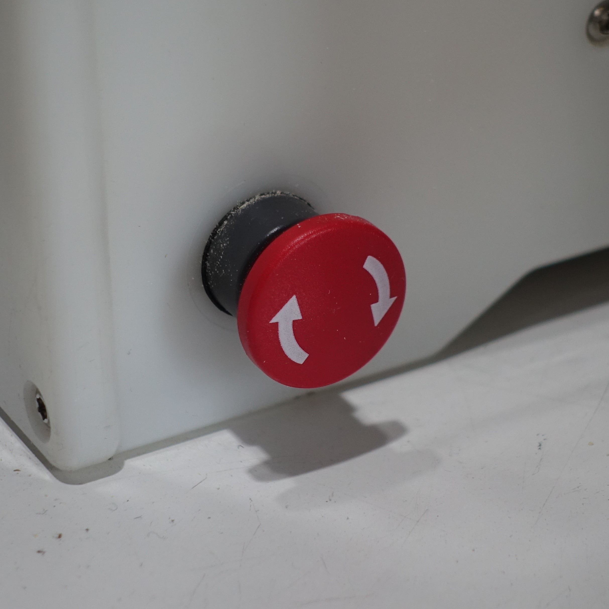
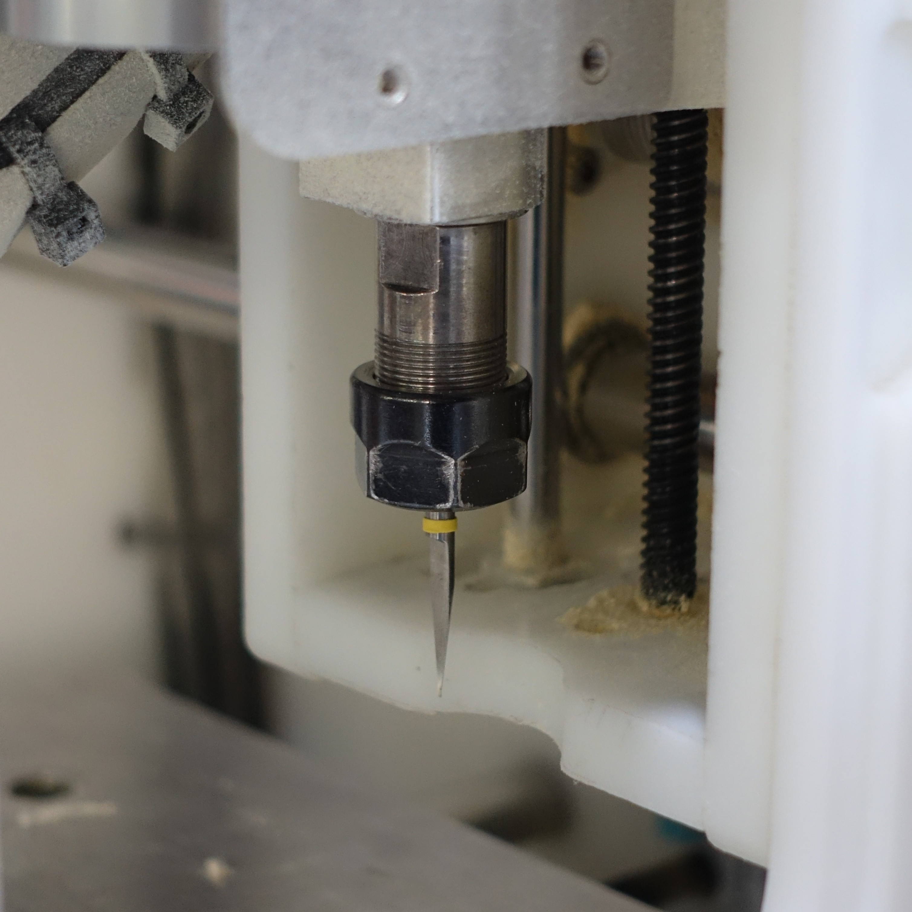
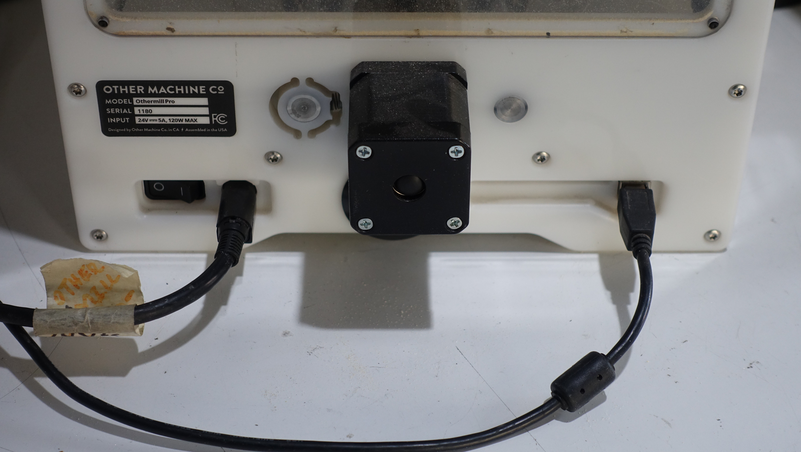
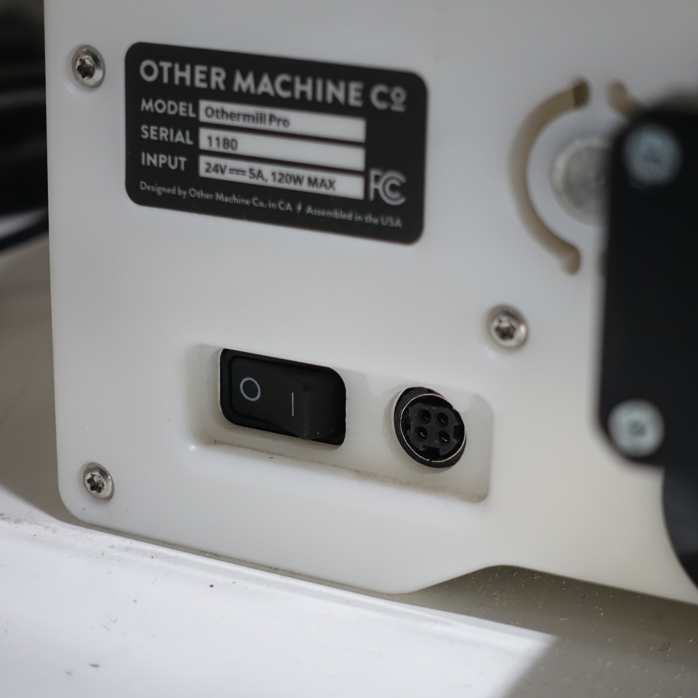
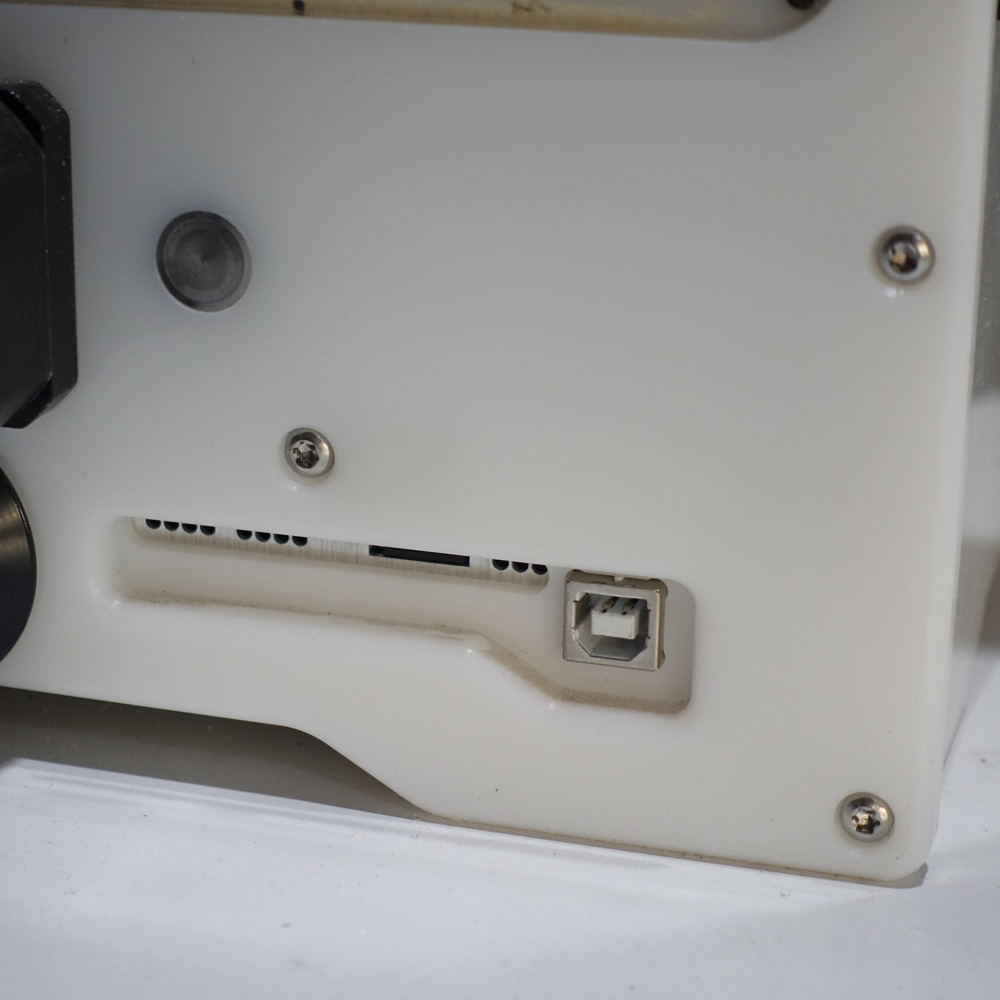

# Guía de uso CNC Othermill Exploratec
Instructivo de la utilización de la maquina Othermill de Bantam Tools para su uso en el taller de Exploratec UDD.

## Uso
La cnc othermill es una fresadora por control numérico computarizado, y al igual que una impresora 3d o una cortadora láser nos ayuda con la manufactura de productos, en este caso específicamente en la producción de circuitos en placas PCB.

TODO foto pcb

### PCB
>*En electrónica, una placa de circuito impreso es una superficie constituida por caminos, pistas o lapices de circuitos buses de material conductor laminadas sobre una base no conductora. El circuito impreso se utiliza para conectar eléctricamente a través de las pistas conductoras, y sostener mecánicamente, por medio de la base, un conjunto de componentes electrónicos. Las pistas son generalmente de cobre, mientras que la base se fabrica generalmente de resinas de fibra de vidrio reforzada, cerámica, plástico, teflón o polímeros como la baquelita.*
>[Wikipedia](https://es.wikipedia.org/wiki/Circuito_impreso)

TODO foto producto con pcb

Las PCB o **placas de circuito impreso**, son usadas para la **producción serializada** de componentes electrónicos, y su uso se extiende a la mayoría de productos con alguna clase de circuito. Al desarrollar un proyecto que cuenta con algún circuito se suele comenzar prototipando en un *protoboard*, dicho prototipo tendría como objetivo validar el funcionamiento de la electrónica, tras ello el siguente paso sería fabricar el circuito en PCB, esta vez pensando en dimensiones físicas, ensambles, y en la integralidad del producto.

Una placa PCB cuenta con varias capas, pero en su forma básica tiene una capa de sustrato y una capa de cobre, existen algunas con más capas de estas, e incluso con otras capas.

La capa de sustrato está hecha de un material aislante, y la capa de cobre, debido a su composición, es conductiva. Esto permite generar conexiones eléctricas entre distintos componentes sustrayendo cobre de la placa, generando las llamadas pistas.

TODO foto capas de un pcb

Para el diseño de estas placas existen softwares en los que se pueden generar esquemáticos y placas, como KiCad, Fritzing, o Autodesk Eagle; de las tres se recomienda **KiCad** por ser open source y por contar con mantenimiento regular.

TODO foto kicad

## La máquina
El modelo de la CNC es **Othermill Pro** de *Other Machine Co.* 
|**Othermill Pro**
:----:

|Botón de emergencia | Portaherramienta
:----------------------:|:----------------------------:
 | 

|cama
:----:

En la parte trasera de la máquina está el interruptor de encendido, la conexión a la corriente y al computador.

TODO hablar de las acciones al usarla, desde el encendido

### Las fresas
TODO Fresas para las pistas

TODO Fresas para corte

## El software
TODO hablar de la versión compatible y donde encontrarla

TODO funciones del software

>#### El siguente paso
>Si ya lograste producir tus circuitos PCB con la Othermill te invitamos a dar el siguiente paso investigando más sobre la manufactura de circuitos, hay muchos tipos y técnicas, como también tienes la posibilidad de delegar la manufactura en un tercero como JLC-PCB y PCB-Way.

>documentado por [AndresMartinM](https://github.com/AndresMartinM) y por [ElPerroGCP](https://github.com/ElPerroGCP) 2025