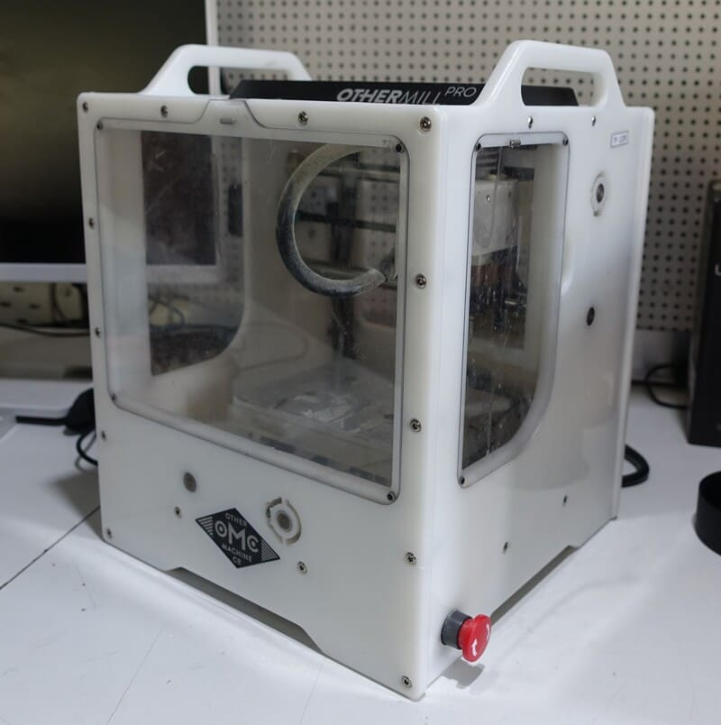
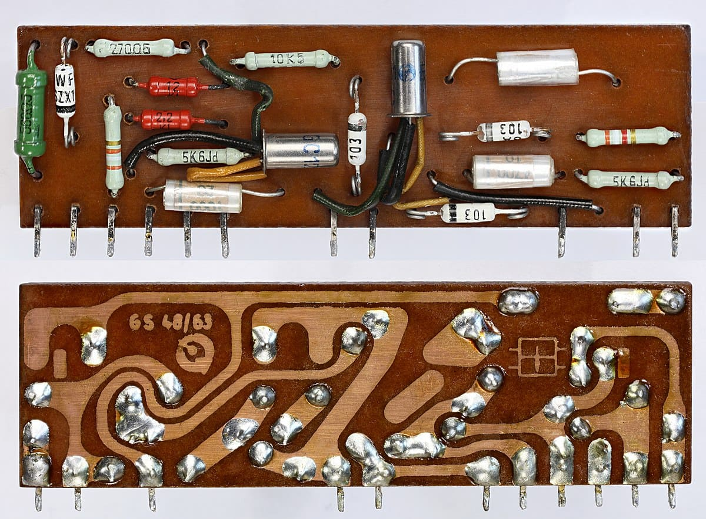
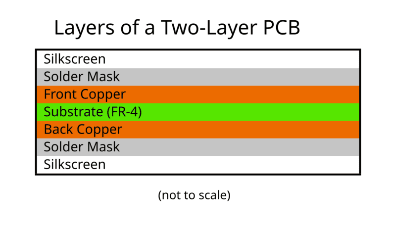
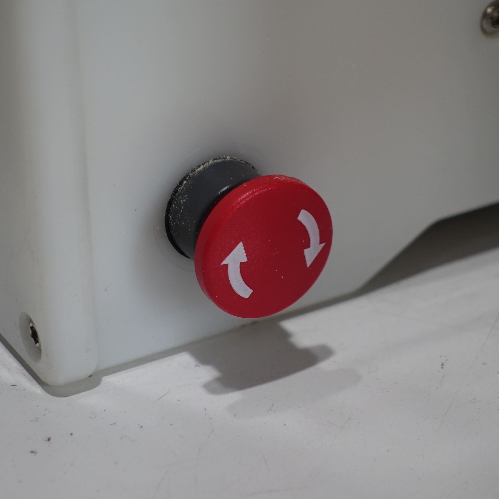
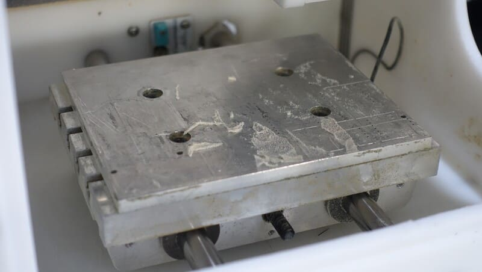
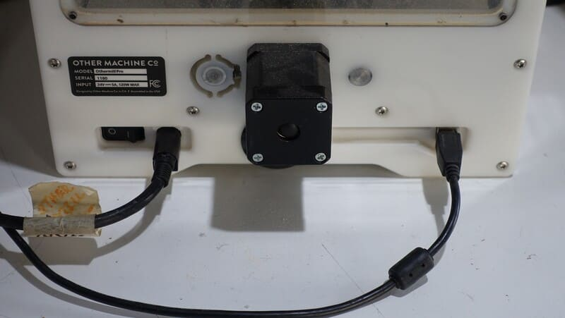
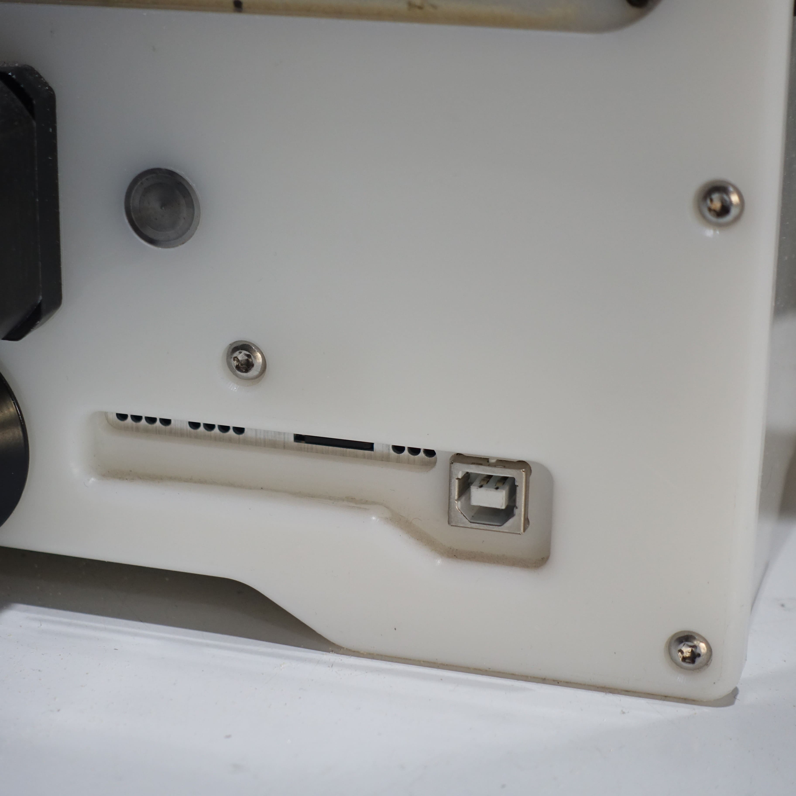

# Guía de uso CNC Othermill Exploratec
Instructivo de la utilización de la maquina Othermill con Bantam Tools para su uso en el taller de Exploratec UDD.

------------------------

$$\color{red}\Huge{\textsf{Considerar!}}$$

### Precauciones

- Verificar que no haya gente transitando mientras se vaya a usar
- Verificar sujeción de la fresa 
- Mantenerse junto a la maquina mientras está trabajando
- Mantener las tapas acrílicas cerradas

### Herramientas

###### Fresas para el mecanizado:
- Fresa de grabado punta V 
- Fresa en espiral
(más adelante se especifica)

###### Para el cambio y sujeción de fresa:
- Llave punta corona 13mm
- Llave punta corona 17mm

###### Para el mantenimiento:
- Retirar la fresa por precaución
- Usar la aspiradora para retirar el polvo

------------------------

## Uso
La cnc othermill es una fresadora por control numérico computarizado, y al igual que una impresora 3d o una cortadora láser nos ayuda con la manufactura de productos, en este caso específicamente en la producción de circuitos en placas PCB.

>
<a href="https://commons.wikimedia.org/wiki/File:GS48_63.jpg">Mister rf</a>, <a href="https://creativecommons.org/licenses/by-sa/4.0">CC BY-SA 4.0</a>, via Wikimedia Commons

### PCB
>*En electrónica, una placa de circuito impreso es una superficie constituida por caminos, pistas o lapices de circuitos buses de material conductor laminadas sobre una base no conductora. El circuito impreso se utiliza para conectar eléctricamente a través de las pistas conductoras, y sostener mecánicamente, por medio de la base, un conjunto de componentes electrónicos. Las pistas son generalmente de cobre, mientras que la base se fabrica generalmente de resinas de fibra de vidrio reforzada, cerámica, plástico, teflón o polímeros como la baquelita.*
>[Wikipedia](https://es.wikipedia.org/wiki/Circuito_impreso)

Las PCB o **placas de circuito impreso**, son usadas para la **producción serializada** de componentes electrónicos, y su uso se extiende a la mayoría de productos con alguna clase de circuito. Al desarrollar un proyecto que cuenta con algún circuito se suele comenzar prototipando en un *protoboard*, dicho prototipo tendría como objetivo validar el funcionamiento de la electrónica, tras ello el siguente paso sería fabricar el circuito en PCB, esta vez pensando en dimensiones físicas, ensambles, y en la integralidad del producto.

>
<a href="https://commons.wikimedia.org/wiki/File:Canon_PowerShot_G11_-_Rear_view_of_the_interior.jpg">Teardown Central</a>, <a href="https://creativecommons.org/licenses/by-sa/2.0">CC BY-SA 2.0</a>, via Wikimedia Commons

Una placa PCB cuenta con varias capas, pero en su forma básica tiene una capa de sustrato y una capa de cobre, existen algunas con más capas de estas, e incluso con otras capas.

La capa de sustrato está hecha de un material aislante, y la capa de cobre, debido a su composición, es conductiva. Esto permite generar conexiones eléctricas entre distintos componentes sustrayendo cobre de la placa, generando las llamadas pistas.

>
<a href="https://commons.wikimedia.org/wiki/File:Layers_of_Single-Layer_PCB_Simplified.svg">Gregortiverse</a>, CC0, via Wikimedia Commons

Para el diseño de estas placas existen softwares en los que se pueden generar esquemáticos y placas, como KiCad, Fritzing, o Autodesk Eagle; de las tres se recomienda **KiCad** por ser open source y por contar con mantenimiento regular.

Al diseñar una placa de circuito se deben generar los distintos archivos ***gerber***, para su fabricación. Cada capa del circuito tiene su propio archivo, los que se deben importar en el software de la máquina.

## La máquina
El modelo de la CNC es **Othermill Pro** de *Other Machine Co.* en su cara frontal, trasera, y laterales tiene tapas acrílicas 

|**Othermill Pro**
:----:

|Botón de emergencia | Portaherramienta
---------------------|-------------------------
 | 

|Cama del CNC
:----:

En la parte trasera de la máquina está el interruptor de encendido, la conexión a la corriente y al computador.

|Parte trasera|
:------:
||

|Encendido y alimentación  | Puerto USB tipo B 
---------------------------|-------------------------------
 | 

Para poder hacer uso de la máquina, esta debe estas conectada a la corriente y al computador con sus respectivos cables, luego para encenderla se presiona el interruptor trasero (O apagado / I encendido), si está encendida se iluminará el interior de esta.

### Las fresas
Existen fresas para distintos usos, por lo que para fabricar una pcb se debe cambiar la fresa antes de cada etapa. Principalmente hay 3 usos, grabado de pistas, perforaciónes y cortes.

Para aislar las pistas se usan fresas de grabado, también llamadas fresas en V, esta etapa se realiza antes del corte y perforado, para esto estamos usando la fresa de 20°, se recomienda usar el preset `PCB Engraving Bit 0.005"` en la máquina.

Para las perforaciones se recomienda usar fresas en espiral de 0.8mm, estas son muy delicadas por lo que se debe trabajar con cuidado de no dañarla. Para evitar roturas mientras está fresando, se recomienda usar el preset `Fresa_Holes-0.8` configurado por [eeminionn](https://github.com/eeminionn) debería ser el adecuado.

Para los cortes estamos usando la fresa de grabado en V, pero con otra configuración llamada `Fresa_Outline-0.8` adaptada por [eeminionn](https://github.com/eeminionn).

## El software
Para usar la maquina en el taller se cuenta con un equipo con ***Bantam Tools Desktop Milling Machine Software*** instalado, el equipo cuenta también con los distintos presets que usamos en el taller para la fabricación de las placas.

Si deseas instalar el software en tu propio PC puedes descargarla desde la página de Bantam: [*Bantam Tools Milling Machine Software*](https://support.bantamtools.com/hc/en-us/articles/29471852026131-Bantam-Tools-Milling-Machine-Software)

En el taller la versión usada es la `2.5.34` y en el caso de no estar disponible en la web de bantam, dentro de este repositorio está el instalador de windows correspondiente como respaldo.

Este software toma los archivos gerber y genera un plan de mecanizado en gcode para enviar a la máquina. Para lograrlo hay que pasar por distintas etapas:
- ***Material Setup*** (configurar las dimensiones, posición y tipo de material)
- ***File Setup*** (configurar el archivo gerber o bord de la placa, así como las herramientas que se usaran con cada capa)
- ***Plan Setup*** (configurar la ubicación del mecanizado, y previsualizar el plan de fresado)
- ***Summary / Run Job*** (iniciar el mecanizado)

Cada una de ellas relacionada a lo que hagamos en la máquina, por lo que a continuación se detalla el paso a paso, tanto de lo que se debe hacer en el software como con el hardware.

[CONTIUNUAR A LA FABRICACIÓN](fab/)

---

>documentado por [AndresMartinM](https://github.com/AndresMartinM) y por [eeminionn](https://github.com/eeminionn) 2025