# Guía de uso CNC Othermill Exploratec
Instructivo de la utilización de la maquina Othermill con Bantam Tools para su uso en el taller de Exploratec UDD.

----

$$\color{red}\Huge{\textsf{Considerar!}}$$

### Mañas del proceso

Algunas de las funcionalidades del software de Bantam Tools tienen problemas si no se realizan de una menera en específico:

- Al digitar números decimales usar la coma en lugar de puntos (ej:0,2), esto se debe corregir cada vez que se cambia un número.
- Al realizar un cambio en un valor, u opción, se debe presionar Intro para configurar la modificación.

Además se deben tomar todas las precauciones indicadas anteriormente:

### Precauciones

- Verificar que no haya gente transitando mientras se vaya a usar
- Verificar sujeción de la fresa 
- Mantenerse junto a la maquina mientras está trabajando
- Mantener las tapas acrílicas cerradas

Así como también contar con las herramientas necesarias:
### Herramientas

###### Fresas para el mecanizado:
- Fresa de grabado punta V 
- Fresa en espiral
(más adelante se especifica)

###### Para el cambio y sujeción de fresa:
- Llave punta corona 13mm
- Llave punta corona 17mm

###### Para el mantenimiento:
- Retirar la fresa por precaución
- Usar la aspiradora para retirar el polvo

----

## Paso a paso

Teniendo la máquina encendida y conectada vía USB, y el computador con el programa de Bantam Tools abierto podrás comenzar con lo siguiente: 

### Movimiento del cabezal

Antes de comenzar se debe conocer el manejo del movimiento de la fresa, para esto hay que abrir el menu **JOG** que se encuentra en la esquina inferior izquierda. En él se podrá mover presionando las flechas que dicen `-X` `+X` para los lados, `-Y` `+Y` para adelante y atras, y `-Z` `+Z` para arriba y abajo. Además están los botones: `HOME` para volver al origen, y `ORIGIN` para guardar un nuevo origen en las coordenadas actuales, el último es `INSTALL TOOL` que nos sirve para que la máquina reconozca la altura de la fresa que esté instalada.

### Fabricación de una PCB

Para la fabricación de una placa hay que tener una PCB sin perforar de una o dos capas (se recomenda trabajar con una sola capa para evitar problemas de calces), y esta habrá que dimensionarla y adherirla a la cama de la othermill. Para el dimensionado en el taller contamos con dremell y su disco de corte, y para pegarla a la cama de aluminio usamos cinta doblefaz delgada (no de la acolchada) y la pegamos calzando en una de las esquinas delanteras.

En la pestaña `MATERIAL SETUP` podremos configurar el tamaño de nuestra placa (Figura A.6), en el caso de las PCB que usamos el espesor es 1.6mm por lo que en eje z ponemos 1,6, el X e Y dependerán de como lo hayamos dimensionado. Dependiendo de en qué esquina hayamos adherido la placa seleccionamos el *Alignment* (Figura A.7) y pasamos a la etapa de configuración de archivo.

| A. ***Material Setup*** |
|:---:|
| A.1 Instalar fresa |
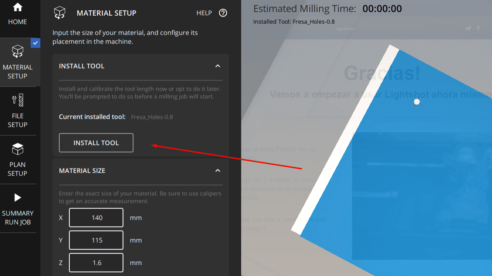
| A.2 Seleccionar fresa |
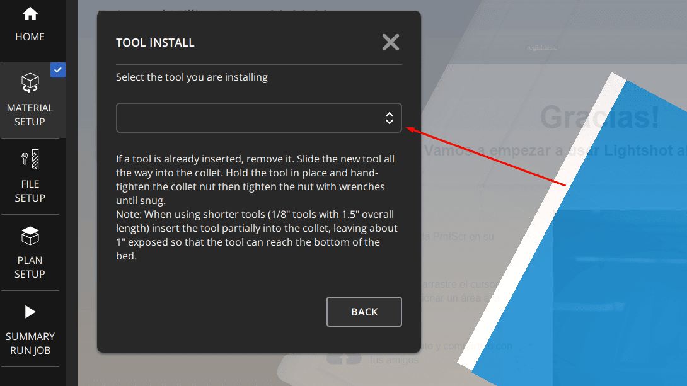
| A.3 Elegir fresa a instalar |
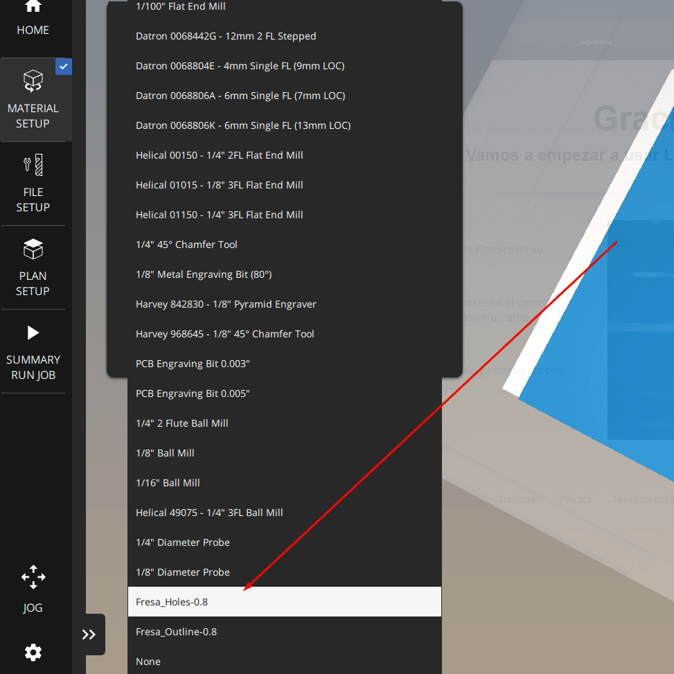
| A.4 Confirmar fresa para iniciar instalación |
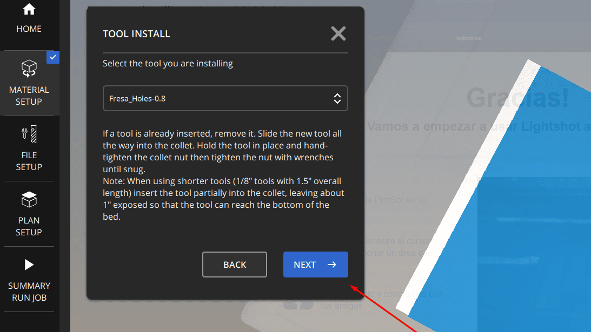
| A.5 Posicionar fresa **sobre aluminio** |
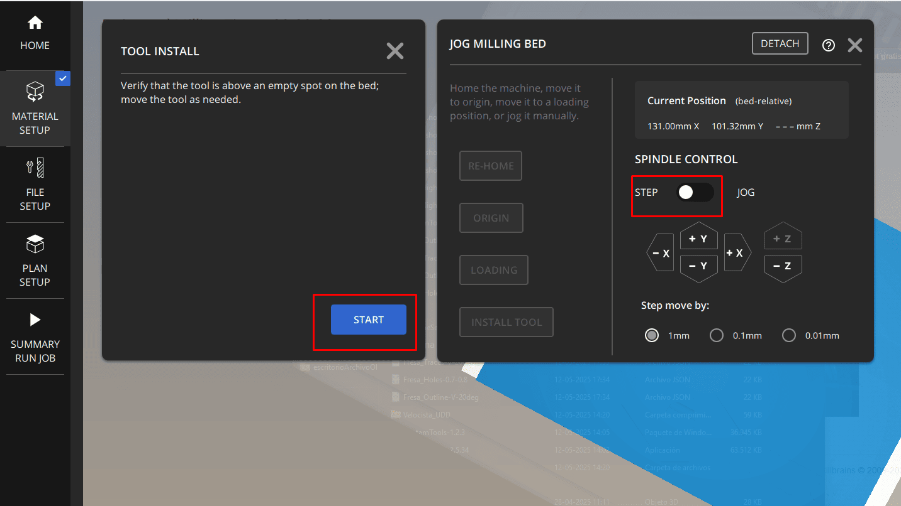
| A.6a Pegar el material |
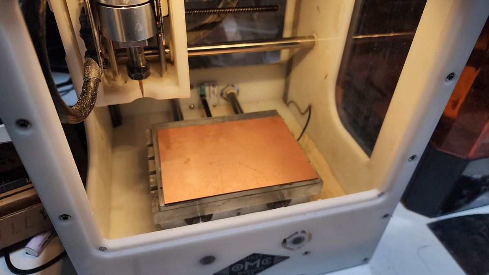
| A.6b Configurar tamaño del material |
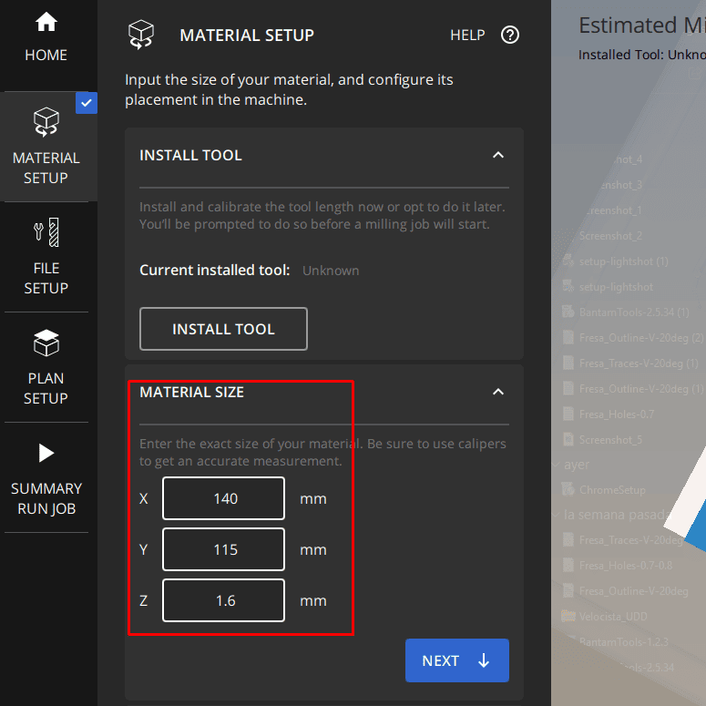
| A.7 Definir offset y posición del material |
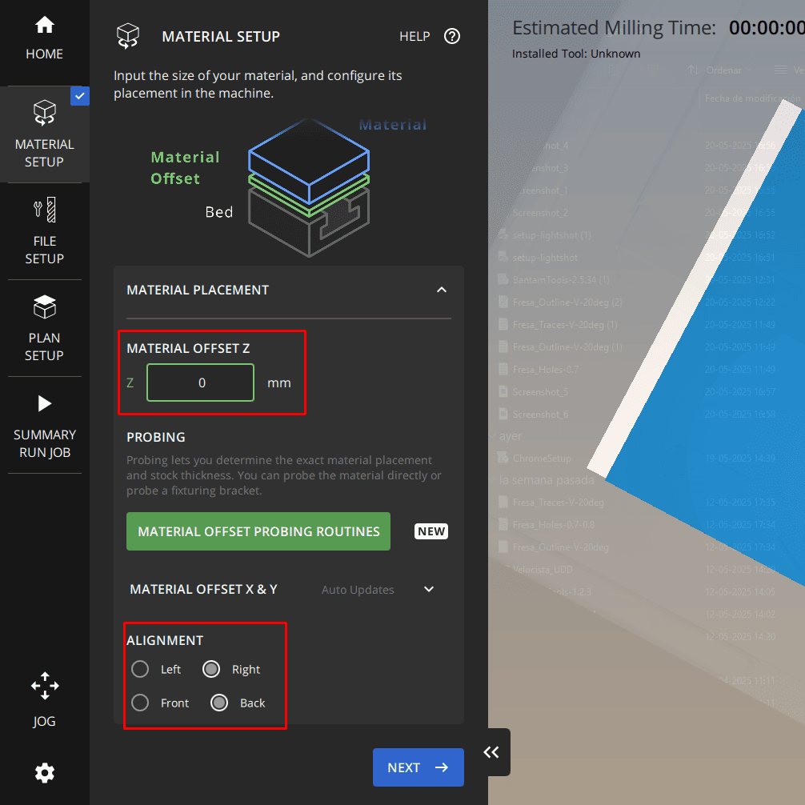

En la pestaña `FILE SETUP` podremos configurar el archivo a fresar, primero importamos el archivo ya sea .grb o .brd, tal como se ve en (Figura B.1), luego en el menú que se despliega configuramos la fresa a ocupar en la casilla de `Milling Tools` tal como se ve en la imagen (Figura B.2), del mismo modo se configuran los parámetros de `Side` (usualmente se mantiene bottom) y se activa la función de mecanizado deseada `Traces / Holes / Outline` (para los perfiles recomendados se mecaniza una función a la vez), como recomendación, se aconseja ocupar un `Trace Clearence` >= 3.5

Por ultimo generamos el `GCODE` y revisamos que no exista alguna inconsistencia en las previsualización de la placa.

###### *En el caso de importar un archivo .grb se tiene que importar individualmente la capa de pistas, corte y perforaciones*

| B. ***File Setup*** |
:---:
| B.1 Seleccionar archivo |
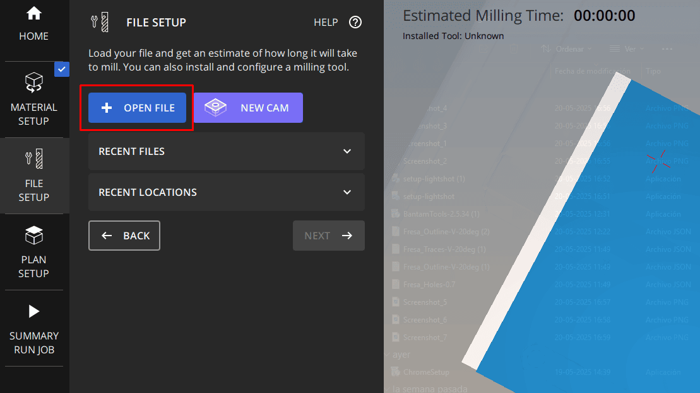
| B.2 Configurar fresa y parámetros |
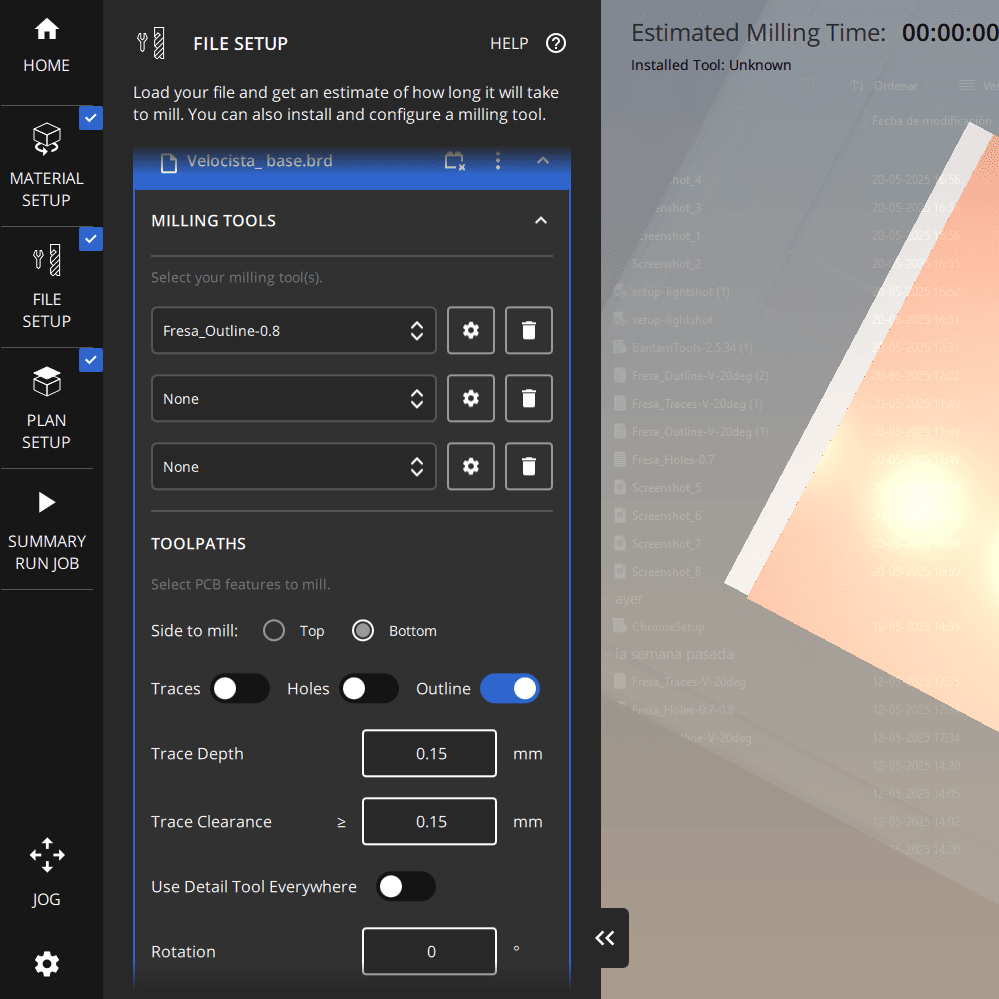
| B.3 Generar GCODE (revisar previo al fresado) |
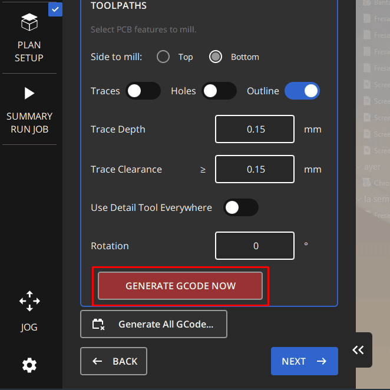

Teniendo lista la configuración de el/los archivos se puede continuar con la pestaña de `PLAN SETUP`, en ella se puede mover la úbicación en la que se realizará el mecanizado (Figura C.1), esto no sirve por ejemplo si queremos hacer varias PCB con la misma placa. A continuación se puede realizar el último paso que es iniciar el fresado en la pestaña `SUMMARY / RUN JOB` (Figura C.2). En esa pestaña está el botón `Mill Single File`, al presionarlo la máquina nos advertirá en el caso de tener una fresa instalada distinta a la necesaria, para ello tendremos que realizar el proceso de `Install Tool` (desde Figura A.1 a Figura A.5), en este proceso hay que tener cudado en el momento que baje la fresa, puesto que si baja sobre la placa PCB no tocará la cama de aluminio, lo que es necesario para detectar conductividad y "setear" la altura.

| C. ***Plan Setup*** **y** ***Run Job*** |
:---:
| C.1 Configurar offset |
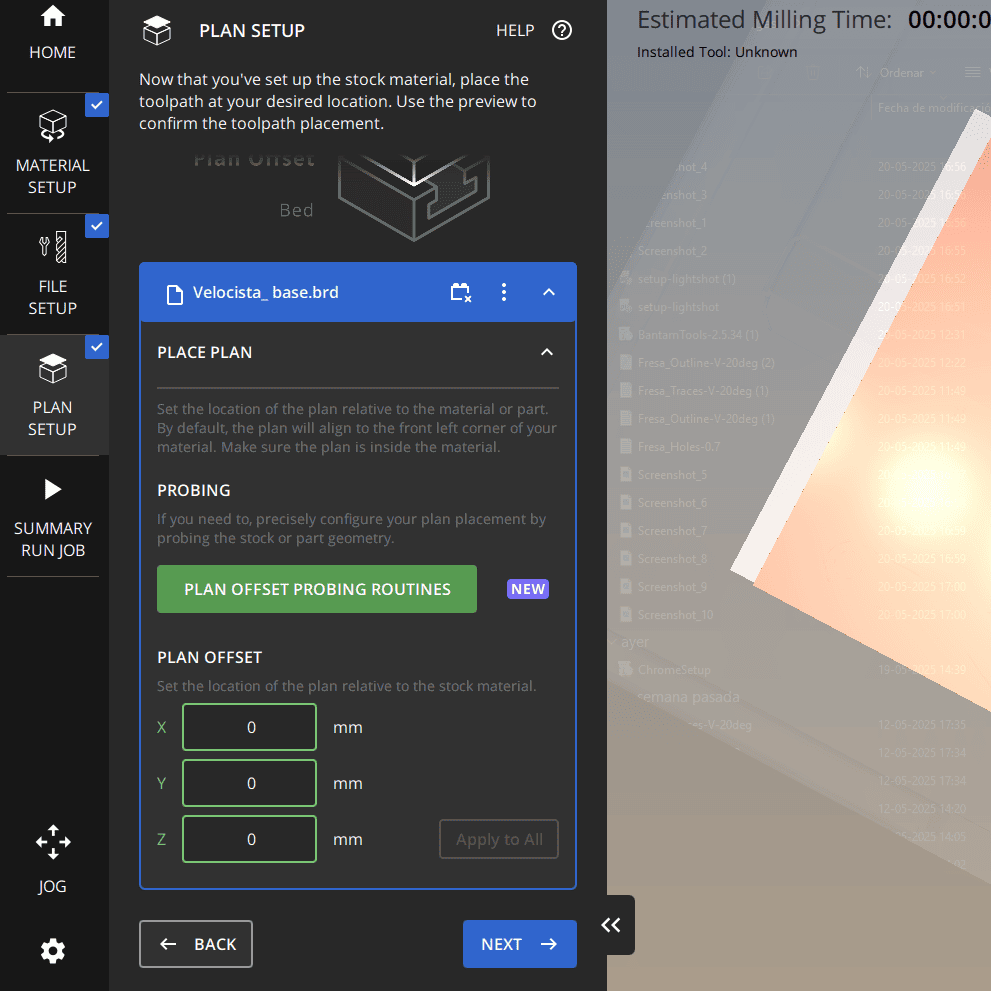
| C.2 Revisar selección de fresa y comenzar fresado |
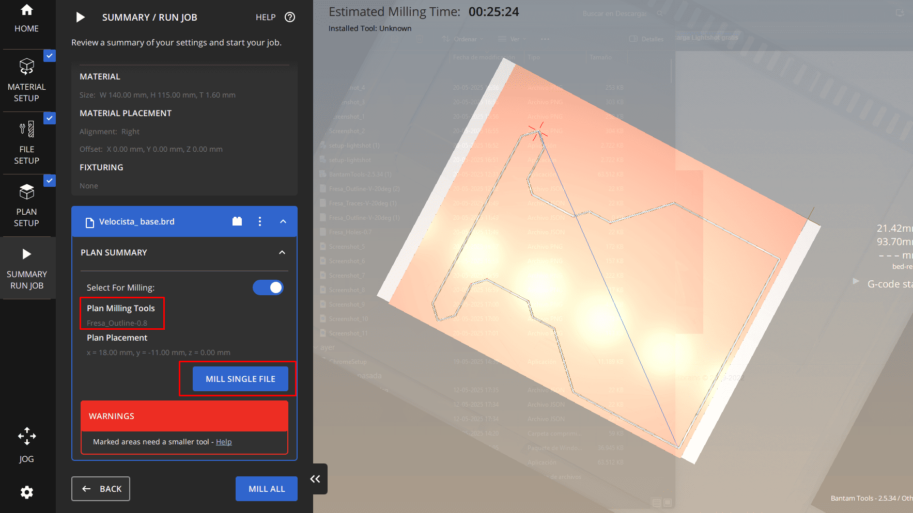

---

##### El siguente paso
###### Si ya lograste producir tus circuitos PCB con la Othermill te invitamos a dar el siguiente paso investigando más sobre la manufactura de circuitos, hay muchos tipos y técnicas, como también tienes la posibilidad de delegar la manufactura en un tercero como JLC-PCB y PCB-Way.

>documentado por [AndresMartinM](https://github.com/AndresMartinM) y por [eeminionn](https://github.com/eeminionn) 2025